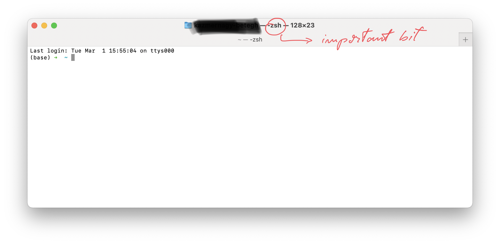

## Intro

I am creating this guide beacuse of the frustation of fragmented information accross the web and forums about how to install python and tensorflow on an M1 machine to run natively. 

## Step 1 - Be Up to Date

Update your computer if you are below macos 12.3. You can check this by clicking on the apple logo on your screens upper left corner. 

## Step 2 - Download HomeBrew

Homebrew is a package distribution platform through which you can install various software on your laptop.

You can check out the HomeBrew Website here: https://brew.sh 

Open terminal and use the following command:

`/bin/bash -c "$(curl -fsSL https://raw.githubusercontent.com/Homebrew/install/HEAD/install.sh)"`

This shall download homebre on your machine. Do not forget to follow the last steps after your installation that homebrew prompts. Which will look something like this: 

`- Add Homebrew to your PATH in ~/.zprofile:
echo 'eval "$(/opt/homebrew/bin/brew shellenv)"' >> ~/.zprofile
eval "$(/opt/homebrew/bin/brew shellenv)"`

## Step 3 - Install Miniforge from Homebrew

**Miniforge** is a forge of the command line anaconda environment manager that contains builds for arm64 processors such as the apple M1 chip. 

The anaconda software package in itself is great tool for managing python environments which allows you to have clean distinguished installations of multiple python versions connected with different packages. You can learn about it more here: https://anaconda.org 

Miniforge allows you to do the same things as anaconda withouth a graphical user interface. While Anaconda is the go to recommendation for most beginners for package management it has not yet been updated for the new arm based Mac processors. You are still able to use it but things won't run as fast as Rossetta2 (https://support.apple.com/en-gb/HT211861) has to translate everything from Anaconda, which might cause bugs as well. 

Run this command to install Miniforge:

`brew install --cask miniforge` 

Once the installation is complete you will need to close the terminal and reopen. Then you will need to use the following command:

`conda init zsh` or `conda init bash` This depends on which kinf of terminal profile your machine uses you can check by looking at top of your terminal window. 

### Intermediate Step if you have Anaconda installed

You only need this step if you have previously installed anaconda and want to use native installation from now on. If this doesn't apply to you jump to the next step.

Go into the following folder:

/Users/<your-username\>

Use the following key combination to reveal your hidden files: command+shift+.

The file name you are looking for is either **.zshrc** or **.bahs-profile** based on what you determined in the previous step.

It should look somewhat like this:

Make sure to change all instances of `Anaconda3` within this file to `miniforge`.

After this repeat the conda init steps from step 3.

## Step 4 - Create a Conda Enviroment

Create a conda enviroment and don't forget to specify the python version as it is crucial.

`conda create --name <name-you-like> python==3.9.7` 

Activate the enviroment:

`conda activate <name-you-like>` 

Install tensorflow dependencies for mac:

`conda install -c apple tensorflow-deps`

Install tensorflow:

`pip install tensorflow-macos`

`pip install tensorflow-metal`

**Aand with all this done you should be ready to go using your m1 mac for datasciece. Just make sure to pick the enviroment you just created as the python interpreter in the IDE of your choice.**

