 Download my apple_data


# Apple Closing Price LSTM RNN Models


```python
# libraries
import pandas as pd
import numpy as np
import matplotlib.pyplot as plt
import seaborn as sns
import tensorflow as tf
import tensorflow.keras as keras
from tensorflow.keras.models import Sequential
from tensorflow.keras.layers import Dense, LSTM, Dropout, SimpleRNN
from tensorflow.keras.callbacks import EarlyStopping
from sklearn.preprocessing import KBinsDiscretizer, OneHotEncoder, LabelEncoder, MinMaxScaler, StandardScaler
```


```python
# set seeds for max reproducibility

from numpy.random import seed
seed(1)
tf.random.set_seed(2)
```


```python
# load the data
aapl = pd.read_csv('aapl.csv')

aapl.Date = pd.to_datetime(aapl.Date)

aapl.head()
```


<div>
<style scoped>
    .dataframe tbody tr th:only-of-type {
        vertical-align: middle;
    }

    .dataframe tbody tr th {
        vertical-align: top;
    }

    .dataframe thead th {
        text-align: right;
    }
</style>
<table border="1" class="dataframe">
  <thead>
    <tr style="text-align: right;">
      <th></th>
      <th>Date</th>
      <th>Open</th>
      <th>High</th>
      <th>Low</th>
      <th>Close</th>
      <th>Adj Close</th>
      <th>Volume</th>
    </tr>
  </thead>
  <tbody>
    <tr>
      <th>0</th>
      <td>1980-12-12</td>
      <td>0.128348</td>
      <td>0.128906</td>
      <td>0.128348</td>
      <td>0.128348</td>
      <td>0.100453</td>
      <td>469033600</td>
    </tr>
    <tr>
      <th>1</th>
      <td>1980-12-15</td>
      <td>0.122210</td>
      <td>0.122210</td>
      <td>0.121652</td>
      <td>0.121652</td>
      <td>0.095213</td>
      <td>175884800</td>
    </tr>
    <tr>
      <th>2</th>
      <td>1980-12-16</td>
      <td>0.113281</td>
      <td>0.113281</td>
      <td>0.112723</td>
      <td>0.112723</td>
      <td>0.088224</td>
      <td>105728000</td>
    </tr>
    <tr>
      <th>3</th>
      <td>1980-12-17</td>
      <td>0.115513</td>
      <td>0.116071</td>
      <td>0.115513</td>
      <td>0.115513</td>
      <td>0.090408</td>
      <td>86441600</td>
    </tr>
    <tr>
      <th>4</th>
      <td>1980-12-18</td>
      <td>0.118862</td>
      <td>0.119420</td>
      <td>0.118862</td>
      <td>0.118862</td>
      <td>0.093029</td>
      <td>73449600</td>
    </tr>
  </tbody>
</table>
</div>


```python
# plot the closing price
fig, ax = plt.subplots(figsize=(12, 8))
ax.plot(aapl.Date, aapl['Close'])
ax.set_title('AAPL closing price')
ax.set_xlabel('Date')
ax.set_ylabel('Price')
plt.show()
```


    
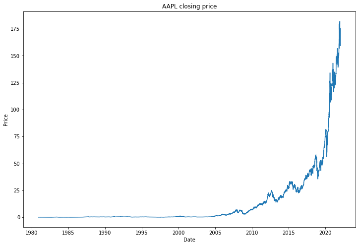
    


## Create the LSTM model


```python
# center all columns apple

apple_norm = aapl.copy()

dates = apple_norm['Date']

dates = pd.to_datetime(dates)

apple_norm = apple_norm.drop(['Date'], axis=1)

a_scaler = MinMaxScaler(feature_range=(0, 1))

apple_norm = pd.DataFrame(a_scaler.fit_transform(apple_norm), columns=apple_norm.columns)

apple_norm.head()
```


<div>
<style scoped>
    .dataframe tbody tr th:only-of-type {
        vertical-align: middle;
    }

    .dataframe tbody tr th {
        vertical-align: top;
    }

    .dataframe thead th {
        text-align: right;
    }
</style>
<table border="1" class="dataframe">
  <thead>
    <tr style="text-align: right;">
      <th></th>
      <th>Open</th>
      <th>High</th>
      <th>Low</th>
      <th>Close</th>
      <th>Adj Close</th>
      <th>Volume</th>
    </tr>
  </thead>
  <tbody>
    <tr>
      <th>0</th>
      <td>0.000431</td>
      <td>0.000433</td>
      <td>0.000443</td>
      <td>0.000435</td>
      <td>0.000341</td>
      <td>0.063198</td>
    </tr>
    <tr>
      <th>1</th>
      <td>0.000397</td>
      <td>0.000397</td>
      <td>0.000405</td>
      <td>0.000399</td>
      <td>0.000312</td>
      <td>0.023699</td>
    </tr>
    <tr>
      <th>2</th>
      <td>0.000348</td>
      <td>0.000348</td>
      <td>0.000355</td>
      <td>0.000350</td>
      <td>0.000274</td>
      <td>0.014246</td>
    </tr>
    <tr>
      <th>3</th>
      <td>0.000361</td>
      <td>0.000363</td>
      <td>0.000371</td>
      <td>0.000365</td>
      <td>0.000286</td>
      <td>0.011647</td>
    </tr>
    <tr>
      <th>4</th>
      <td>0.000379</td>
      <td>0.000381</td>
      <td>0.000390</td>
      <td>0.000383</td>
      <td>0.000300</td>
      <td>0.009897</td>
    </tr>
  </tbody>
</table>
</div>


```python
n_inputs = 10
n_predictions = 1
batch_size = 32
```


```python
# training and testing data

train_data = apple_norm[:round(len(apple_norm["Open"])*0.8)]
# valid_data = apple_norm[round(len(apple_norm["Open"])*0.6):]
test_data = apple_norm[round(len(apple_norm["Open"])*0.8):]

```


```python

# shape training data for LSTM
n_inputs = 10
n_predictions = 1
batch_size = 32

# save test data for later


X_train = []
y_train = []

for i in range(n_inputs, len(train_data) - n_predictions+1):
    X_train.append(train_data.iloc[i-n_inputs:i , 0:6])
    y_train.append(train_data.iloc[i+n_predictions - 1 : i + n_predictions, 3])


X_train, y_train = np.array(X_train), np.array(y_train)

X_train = keras.backend.cast_to_floatx(X_train)
# y_train = keras.backend.cast_to_floatx(y_train)

print(X_train.shape)
print(y_train.shape)
```

    (8288, 10, 6)
    (8288, 1)


```python
def preprocess_lstm(df,n_inputs=10, n_predictions=1, n_features=6):

    X_train = []
    y_train = []


    for i in range(n_inputs, len(df) - n_predictions+1):
        X_train.append(df.iloc[i-n_inputs:i , 0:n_features])
        y_train.append(df["Close"][i : i + n_predictions])


    X_train, y_train = np.array(X_train), np.array(y_train)

    return X_train, y_train

```


```python
# build LSTM model

model_lstm = Sequential()

model_lstm.add(LSTM(units=64, 
                    return_sequences=False,
                    input_shape=(10, 6)
                    ))

model_lstm.add(Dense(units=1))


model_lstm.compile(optimizer='adam', 
                    loss='logcosh',
                    metrics= "mse")

```


```python
model_lstm.summary()
```

    Model: "sequential_4"
    _________________________________________________________________
    Layer (type)                 Output Shape              Param #   
    =================================================================
    lstm_5 (LSTM)                (None, 64)                18176     
    _________________________________________________________________
    dense_10 (Dense)             (None, 1)                 65        
    =================================================================
    Total params: 18,241
    Trainable params: 18,241
    Non-trainable params: 0
    _________________________________________________________________


```python
# early stopping
early_s = EarlyStopping(monitor='val_loss',patience=15)
```


```python
X_train, y_train = preprocess_lstm(train_data, n_inputs=10, n_predictions=1, n_features=6)
history = model_lstm.fit(X_train, y_train, epochs=100, batch_size=batch_size, validation_split=0.2, callbacks=[early_s], verbose=0)
```

    2022-02-28 11:03:18.674764: I tensorflow/core/grappler/optimizers/custom_graph_optimizer_registry.cc:112] Plugin optimizer for device_type GPU is enabled.
    2022-02-28 11:03:18.742463: I tensorflow/core/grappler/optimizers/custom_graph_optimizer_registry.cc:112] Plugin optimizer for device_type GPU is enabled.
    2022-02-28 11:03:18.862104: I tensorflow/core/grappler/optimizers/custom_graph_optimizer_registry.cc:112] Plugin optimizer for device_type GPU is enabled.
    2022-02-28 11:03:21.530458: I tensorflow/core/grappler/optimizers/custom_graph_optimizer_registry.cc:112] Plugin optimizer for device_type GPU is enabled.
    2022-02-28 11:03:21.559088: I tensorflow/core/grappler/optimizers/custom_graph_optimizer_registry.cc:112] Plugin optimizer for device_type GPU is enabled.


```python
fig, ax = plt.subplots( figsize=(12, 4))
# ax.plot(history.history['accuracy'], label = 'accuracy', )
ax.plot(history.history['loss'], label = 'loss')
ax.plot(history.history['val_loss'], label = 'val_loss')
# ax.plot(history.history['val_accuracy'], label = 'val_accuracy')
ax.set_title('model accuracy')
ax.set_ylabel('accuracy')
ax.set_xlabel('epoch')
ax.legend()
```


    <matplotlib.legend.Legend at 0x2d174cd00>


    
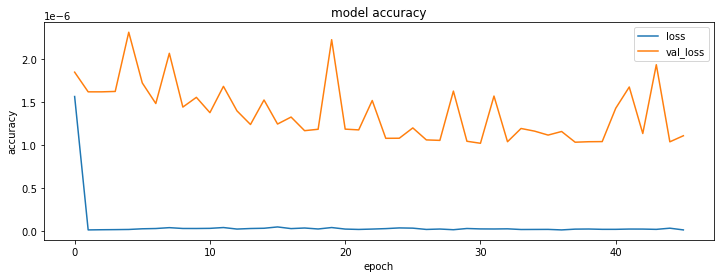
    


```python
X_testing, y_testing = preprocess_lstm(test_data, n_inputs=10, n_predictions=1, n_features=6)

y_predicted = model_lstm.predict(X_testing)
```

    2022-02-28 11:05:02.549520: I tensorflow/core/grappler/optimizers/custom_graph_optimizer_registry.cc:112] Plugin optimizer for device_type GPU is enabled.
    2022-02-28 11:05:02.567498: I tensorflow/core/grappler/optimizers/custom_graph_optimizer_registry.cc:112] Plugin optimizer for device_type GPU is enabled.


```python
y_testing = (y_testing - a_scaler.min_[3] )/a_scaler.scale_[3]
y_predicted = (y_predicted  - a_scaler.min_[3]  )/a_scaler.scale_[3]

fig, ax = plt.subplots( figsize=(16, 6))
ax.plot(dates[-len(test_data)+n_inputs:],y_testing, label = 'actual')
ax.plot(dates[-len(test_data)+n_inputs:],y_predicted, label = 'predicted')
ax.set_title('6 Feature LSMT Model Actual vs Prediction')
ax.set_ylabel('Price')
ax.set_xlabel('Date')
ax.legend()
```


    <matplotlib.legend.Legend at 0x326a55e20>


    
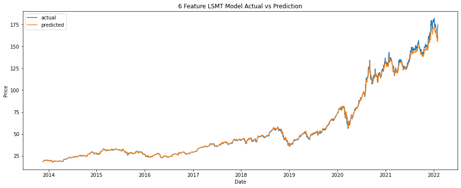
    


## Model Variations Question B

### Simple RNN with only Close Price as Feature


```python
# build RNN model

model_rnn_single = Sequential()

model_rnn_single.add(SimpleRNN(units=64, 
                    return_sequences=False,
                    input_shape=(10, 1)
                    ))

model_rnn_single.add(Dense(units=1))


model_rnn_single.compile(optimizer='adam', 
                    loss='logcosh',
                    metrics= "mse")

```


```python
X_train, y_train = preprocess_lstm(pd.DataFrame(train_data["Close"]), n_inputs=10, n_predictions=1, n_features=1)
```


```python
early_s = EarlyStopping(monitor='val_loss',patience=5)
```


```python
history = model_rnn_single.fit(X_train, y_train, epochs=100, batch_size=100, validation_split=0.2, callbacks=[early_s], verbose=0)
```

    2022-02-28 11:05:03.845275: I tensorflow/core/grappler/optimizers/custom_graph_optimizer_registry.cc:112] Plugin optimizer for device_type GPU is enabled.
    2022-02-28 11:05:07.113098: I tensorflow/core/grappler/optimizers/custom_graph_optimizer_registry.cc:112] Plugin optimizer for device_type GPU is enabled.


```python
fig, ax = plt.subplots( figsize=(12, 4))
# ax.plot(history.history['accuracy'], label = 'accuracy', )
ax.plot(history.history['loss'], label = 'loss')
ax.plot(history.history['val_loss'], label = 'val_loss')
# ax.plot(history.history['val_accuracy'], label = 'val_accuracy')
ax.set_title('model accuracy')
ax.set_ylabel('accuracy')
ax.set_xlabel('epoch')
ax.legend()
```


    <matplotlib.legend.Legend at 0x316d0ca60>


    
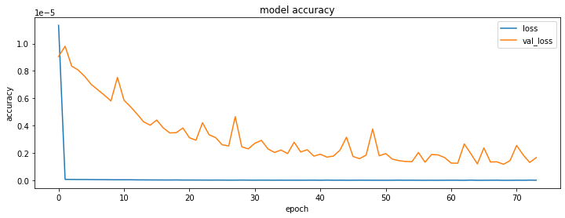
    


```python
# plot the predicted and actual values

X_testing, y_testing = preprocess_lstm(pd.DataFrame(test_data["Close"]), n_inputs=10, n_predictions=1, n_features=1)
y_predicted = model_rnn_single.predict(X_testing)
# Rescale the predicted values
y_testing = (y_testing - a_scaler.min_[3] )/a_scaler.scale_[3]
y_predicted = (y_predicted  - a_scaler.min_[3]  )/a_scaler.scale_[3]

fig, ax = plt.subplots( figsize=(12, 4))
ax.plot(dates[-len(test_data)+n_inputs:],y_testing, label = 'actual')
ax.plot(dates[-len(test_data)+n_inputs:],y_predicted, label = 'predicted')
ax.set_title('Single Feature RNN Model Actual vs Prediction')
ax.set_ylabel('Price')
ax.set_xlabel('Date')
ax.legend()


```

    2022-02-28 11:08:49.840605: I tensorflow/core/grappler/optimizers/custom_graph_optimizer_registry.cc:112] Plugin optimizer for device_type GPU is enabled.


    <matplotlib.legend.Legend at 0x316bd8520>


    
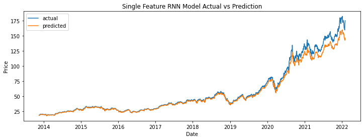
    


### Multi Feature RNN


```python
# build RNN model

n_features = 5

model_rnn_multi = Sequential()

model_rnn_multi.add(SimpleRNN(units=64, 
                    return_sequences=False,
                    input_shape=(10, n_features)
                    ))

model_rnn_multi.add(Dense(units=1))


model_rnn_multi.compile(optimizer='adam', 
                    loss='logcosh',
                    metrics= "mse")

X_train, y_train = preprocess_lstm(train_data, n_inputs=10, n_predictions=1, n_features=n_features)
early_s = EarlyStopping(monitor='val_loss',patience=3)
history_rnn_multi = model_rnn_multi.fit(X_train, y_train, epochs=15, batch_size=100, validation_split=0.2, callbacks=[early_s], verbose=0)
fig, ax = plt.subplots( figsize=(16, 6))
# ax.plot(history.history['accuracy'], label = 'accuracy', )
ax.plot(history_rnn_multi.history['loss'], label = 'loss')
ax.plot(history_rnn_multi.history['val_loss'], label = 'val_loss')
# ax.plot(history.history['val_accuracy'], label = 'val_accuracy')
ax.set_title('model accuracy')
ax.set_ylabel('accuracy')
ax.set_xlabel('epoch')
ax.legend()

```

    2022-02-28 11:08:51.307519: I tensorflow/core/grappler/optimizers/custom_graph_optimizer_registry.cc:112] Plugin optimizer for device_type GPU is enabled.
    2022-02-28 11:08:54.787585: I tensorflow/core/grappler/optimizers/custom_graph_optimizer_registry.cc:112] Plugin optimizer for device_type GPU is enabled.


    <matplotlib.legend.Legend at 0x316d081f0>


    
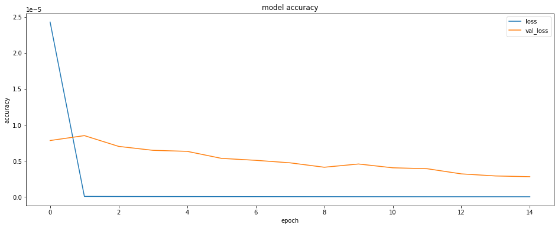
    


```python
X_train, y_train = preprocess_lstm(train_data, n_inputs=10, n_predictions=1, n_features=n_features)
```


```python
early_s = EarlyStopping(monitor='val_loss',patience=3)
```


```python
history_rnn_multi = model_rnn_multi.fit(X_train, y_train, epochs=15, batch_size=100, validation_split=0.2, callbacks=[early_s], verbose=0)
```


```python
fig, ax = plt.subplots( figsize=(16, 6))
# ax.plot(history.history['accuracy'], label = 'accuracy', )
ax.plot(history_rnn_multi.history['loss'], label = 'loss')
ax.plot(history_rnn_multi.history['val_loss'], label = 'val_loss')
# ax.plot(history.history['val_accuracy'], label = 'val_accuracy')
ax.set_title('model accuracy')
ax.set_ylabel('accuracy')
ax.set_xlabel('epoch')
ax.legend()
```


    <matplotlib.legend.Legend at 0x326af1040>


    
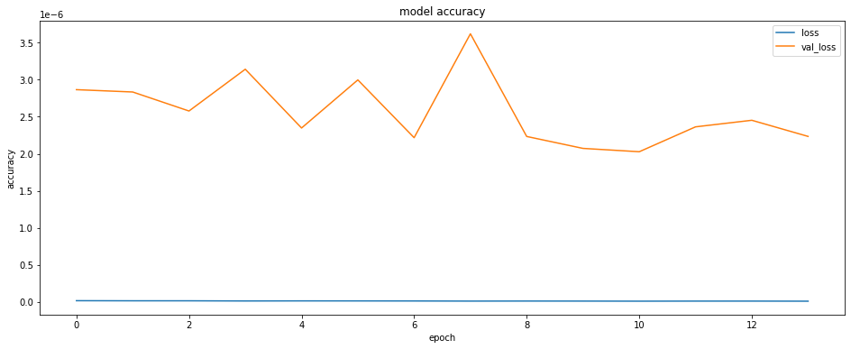
    


```python
# plot the predicted and actual values
X_testing, y_testing = preprocess_lstm(test_data, n_inputs=10, n_predictions=1, n_features=5)
y_predicted = model_rnn_multi.predict(X_testing)
# Rescale the predicted values
y_testing = (y_testing - a_scaler.min_[3] )/a_scaler.scale_[3]
y_predicted = (y_predicted  - a_scaler.min_[3]  )/a_scaler.scale_[3]

fig, ax = plt.subplots( figsize=(16, 6))
ax.plot(dates[-len(test_data)+n_inputs:],y_testing, label = 'actual')
ax.plot(dates[-len(test_data)+n_inputs:],y_predicted, label = 'predicted')
ax.set_title(f'{n_features} Feature RNN Model Actual vs Prediction')
ax.set_ylabel('Price')
ax.set_xlabel('Date')
ax.legend()


```

    2022-02-28 11:10:24.570808: I tensorflow/core/grappler/optimizers/custom_graph_optimizer_registry.cc:112] Plugin optimizer for device_type GPU is enabled.


    <matplotlib.legend.Legend at 0x28b5a8bb0>


    
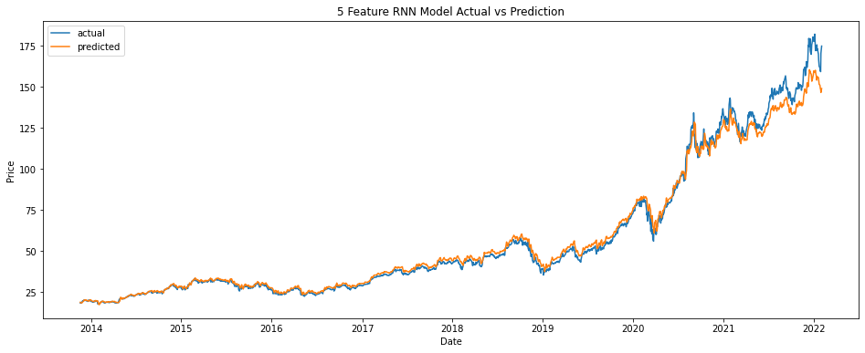
    


## LSTM Hyperparameter Tuning


```python
import keras_tuner as kt
```


```python
# create model for 1 input layer 

def model_builder(hp):

    model = Sequential()
    model.add(LSTM(units=hp.Int('units', min_value=32, max_value=448, step=32), 
                    return_sequences=False,
                    input_shape=(n_input, 6)))
    model.add(Dense(units=1))
    model.compile(optimizer='sgd', 
                    loss='logcosh',
                    metrics= "mse")

    return model
```


```python
stop_early = tf.keras.callbacks.EarlyStopping(monitor='val_loss', patience=5)
```

### Code for input size and Layer size optimisation

It is commented out as it takes very long to run. It works, if someone has the patience for it. 

Will present a shorter hyper parameter tuning after.


```python
# takes over 200 minutes to run on laptop
# hyper_params = pd.DataFrame(columns=['inputs','units', 'val_loss'])

# for i in range(10,30):
#     n_input = i
#     tuner = kt.Hyperband(model_builder,
#                         objective='val_mse',
#                         max_epochs=50,
#                         directory='models',
#                         project_name='lstm_tuner',
#                         overwrite=True)

#     X_train, y_train = preprocess_lstm(train_data, n_inputs=i, n_predictions=1, n_features=6)
#     tuner.search(X_train, y_train, epochs=i, batch_size=100, validation_split=0.2)
#     tuner.results_summary()
#     # tuner.plot()
#     best_hps=tuner.get_best_hyperparameters(num_trials=1)[0]
#     # print(best_hps.get_details())
#     best_model = tuner.hypermodel.build(best_hps)
#     history_best = best_model.fit(X_train,y_train,epochs=50,batch_size=50,validation_split=0.3,callbacks=[stop_early])
#     hyper_params.loc[i] = [i,best_hps.get('units'),min(history_best.history['val_loss'])]


```


```python
# # Shorter version of previous code still 72 minutes
# hyper_params = pd.DataFrame(columns=['inputs','units', 'val_loss'])

# input_size = [10, 15, 20, 24, 25, 30]

# for i in input_size:
#     n_input = i
#     tuner = kt.Hyperband(model_builder,
#                         objective='val_mse',
#                         max_epochs=20,
#                         directory='lstm_tuner_models',
#                         project_name='lstm_tuner',
#                         overwrite=True)

#     X_train, y_train = preprocess_lstm(train_data, n_inputs=i, n_predictions=1, n_features=6)
#     tuner.search(X_train, y_train, epochs=i, batch_size=100, validation_split=0.2)
#     tuner.results_summary()
#     # tuner.plot()
#     best_hps=tuner.get_best_hyperparameters(num_trials=1)[0]
#     # print(best_hps.get_details())
#     best_model = tuner.hypermodel.build(best_hps)
#     history_best = best_model.fit(X_train,y_train,epochs=50,batch_size=50,validation_split=0.3,callbacks=[stop_early])
#     hyper_params.loc[i] = [i,best_hps.get('units'),min(history_best.history['val_loss'])]

# order by val_loss

# hyper_params.sort_values(by=['val_loss'], inplace=True)
# hyper_params

```

### Hyperparameter Tuning LSTM and RNN with GridSearch optimising Neuron numbers and Optimisers


```python
from sklearn.model_selection import GridSearchCV
from keras.wrappers.scikit_learn import KerasRegressor
```


```python
def create_lstm_model(optimiser, neurons):
    model = Sequential()
    model.add(LSTM(units=neurons, 
                    return_sequences=False,
                    input_shape=(15, 6)))

    model.add(Dense(units=1))
    model.compile(optimizer=optimiser, 
                    loss='logcosh',
                    metrics= "mse")
    return model
```


```python
def create_rnn_model(optimiser, neurons):
    # build RNN model

    model_rnn_single = Sequential()

    model_rnn_single.add(SimpleRNN(units=neurons, 
                    return_sequences=False,
                    input_shape=(15, 6)
                    ))

    model_rnn_single.add(Dense(units=1))


    model_rnn_single.compile(optimizer=optimiser, 
                    loss='logcosh',
                    metrics= "mse")
    return model_rnn_single

    
```


```python
model_lstm = KerasRegressor(build_fn=create_lstm_model, verbose=0, epochs = 10, batch_size=100)

model_rnn = KerasRegressor(build_fn=create_rnn_model, verbose=0, epochs = 10, batch_size=100)

```


```python
optimiser = ['adam', 'sgd',"adagrad", "adadelta", "rmsprop"] # all options
optimiser = ['adam', 'sgd'] # for reduced runtime time

neurons = [32, 64, 128]
```


```python
X_train, y_train = preprocess_lstm(train_data, n_inputs=15, n_predictions=1, n_features=6)
```


```python
param_grid = dict(optimiser=optimiser, neurons=neurons)

grid_lstm = GridSearchCV(estimator=model_lstm, param_grid=param_grid, error_score='raise', verbose=0, cv=2)
grid_rnn = GridSearchCV(estimator=model_rnn, param_grid=param_grid, error_score='raise', verbose=0, cv=2)

```


```python

grid_lstm.fit(X_train, y_train, verbose=0)
```

    2022-02-28 11:10:26.783980: I tensorflow/core/grappler/optimizers/custom_graph_optimizer_registry.cc:112] Plugin optimizer for device_type GPU is enabled.
    2022-02-28 11:10:26.849201: I tensorflow/core/grappler/optimizers/custom_graph_optimizer_registry.cc:112] Plugin optimizer for device_type GPU is enabled.
    2022-02-28 11:10:26.968023: I tensorflow/core/grappler/optimizers/custom_graph_optimizer_registry.cc:112] Plugin optimizer for device_type GPU is enabled.
    2022-02-28 11:10:32.434539: I tensorflow/core/grappler/optimizers/custom_graph_optimizer_registry.cc:112] Plugin optimizer for device_type GPU is enabled.
    2022-02-28 11:10:32.459843: I tensorflow/core/grappler/optimizers/custom_graph_optimizer_registry.cc:112] Plugin optimizer for device_type GPU is enabled.
    2022-02-28 11:10:33.238506: I tensorflow/core/grappler/optimizers/custom_graph_optimizer_registry.cc:112] Plugin optimizer for device_type GPU is enabled.
    2022-02-28 11:10:33.301291: I tensorflow/core/grappler/optimizers/custom_graph_optimizer_registry.cc:112] Plugin optimizer for device_type GPU is enabled.
    2022-02-28 11:10:33.419741: I tensorflow/core/grappler/optimizers/custom_graph_optimizer_registry.cc:112] Plugin optimizer for device_type GPU is enabled.
    2022-02-28 11:10:38.905249: I tensorflow/core/grappler/optimizers/custom_graph_optimizer_registry.cc:112] Plugin optimizer for device_type GPU is enabled.
    2022-02-28 11:10:38.932872: I tensorflow/core/grappler/optimizers/custom_graph_optimizer_registry.cc:112] Plugin optimizer for device_type GPU is enabled.
    2022-02-28 11:10:39.700021: I tensorflow/core/grappler/optimizers/custom_graph_optimizer_registry.cc:112] Plugin optimizer for device_type GPU is enabled.
    2022-02-28 11:10:39.762366: I tensorflow/core/grappler/optimizers/custom_graph_optimizer_registry.cc:112] Plugin optimizer for device_type GPU is enabled.
    2022-02-28 11:10:39.888099: I tensorflow/core/grappler/optimizers/custom_graph_optimizer_registry.cc:112] Plugin optimizer for device_type GPU is enabled.
    2022-02-28 11:10:45.353996: I tensorflow/core/grappler/optimizers/custom_graph_optimizer_registry.cc:112] Plugin optimizer for device_type GPU is enabled.
    2022-02-28 11:10:45.382055: I tensorflow/core/grappler/optimizers/custom_graph_optimizer_registry.cc:112] Plugin optimizer for device_type GPU is enabled.
    2022-02-28 11:10:46.172436: I tensorflow/core/grappler/optimizers/custom_graph_optimizer_registry.cc:112] Plugin optimizer for device_type GPU is enabled.
    2022-02-28 11:10:46.236680: I tensorflow/core/grappler/optimizers/custom_graph_optimizer_registry.cc:112] Plugin optimizer for device_type GPU is enabled.
    2022-02-28 11:10:46.389412: I tensorflow/core/grappler/optimizers/custom_graph_optimizer_registry.cc:112] Plugin optimizer for device_type GPU is enabled.
    2022-02-28 11:10:51.854292: I tensorflow/core/grappler/optimizers/custom_graph_optimizer_registry.cc:112] Plugin optimizer for device_type GPU is enabled.
    2022-02-28 11:10:51.879855: I tensorflow/core/grappler/optimizers/custom_graph_optimizer_registry.cc:112] Plugin optimizer for device_type GPU is enabled.
    2022-02-28 11:10:52.672242: I tensorflow/core/grappler/optimizers/custom_graph_optimizer_registry.cc:112] Plugin optimizer for device_type GPU is enabled.
    2022-02-28 11:10:52.737511: I tensorflow/core/grappler/optimizers/custom_graph_optimizer_registry.cc:112] Plugin optimizer for device_type GPU is enabled.
    2022-02-28 11:10:52.873517: I tensorflow/core/grappler/optimizers/custom_graph_optimizer_registry.cc:112] Plugin optimizer for device_type GPU is enabled.
    2022-02-28 11:10:59.105509: I tensorflow/core/grappler/optimizers/custom_graph_optimizer_registry.cc:112] Plugin optimizer for device_type GPU is enabled.
    2022-02-28 11:10:59.130834: I tensorflow/core/grappler/optimizers/custom_graph_optimizer_registry.cc:112] Plugin optimizer for device_type GPU is enabled.
    2022-02-28 11:10:59.994379: I tensorflow/core/grappler/optimizers/custom_graph_optimizer_registry.cc:112] Plugin optimizer for device_type GPU is enabled.
    2022-02-28 11:11:00.067772: I tensorflow/core/grappler/optimizers/custom_graph_optimizer_registry.cc:112] Plugin optimizer for device_type GPU is enabled.
    2022-02-28 11:11:00.186282: I tensorflow/core/grappler/optimizers/custom_graph_optimizer_registry.cc:112] Plugin optimizer for device_type GPU is enabled.
    2022-02-28 11:11:06.252060: I tensorflow/core/grappler/optimizers/custom_graph_optimizer_registry.cc:112] Plugin optimizer for device_type GPU is enabled.
    2022-02-28 11:11:06.278067: I tensorflow/core/grappler/optimizers/custom_graph_optimizer_registry.cc:112] Plugin optimizer for device_type GPU is enabled.
    2022-02-28 11:11:07.370414: I tensorflow/core/grappler/optimizers/custom_graph_optimizer_registry.cc:112] Plugin optimizer for device_type GPU is enabled.
    2022-02-28 11:11:07.427784: I tensorflow/core/grappler/optimizers/custom_graph_optimizer_registry.cc:112] Plugin optimizer for device_type GPU is enabled.
    2022-02-28 11:11:07.542208: I tensorflow/core/grappler/optimizers/custom_graph_optimizer_registry.cc:112] Plugin optimizer for device_type GPU is enabled.
    2022-02-28 11:11:13.521179: I tensorflow/core/grappler/optimizers/custom_graph_optimizer_registry.cc:112] Plugin optimizer for device_type GPU is enabled.
    2022-02-28 11:11:13.549075: I tensorflow/core/grappler/optimizers/custom_graph_optimizer_registry.cc:112] Plugin optimizer for device_type GPU is enabled.
    2022-02-28 11:11:14.373324: I tensorflow/core/grappler/optimizers/custom_graph_optimizer_registry.cc:112] Plugin optimizer for device_type GPU is enabled.
    2022-02-28 11:11:14.437517: I tensorflow/core/grappler/optimizers/custom_graph_optimizer_registry.cc:112] Plugin optimizer for device_type GPU is enabled.
    2022-02-28 11:11:14.564471: I tensorflow/core/grappler/optimizers/custom_graph_optimizer_registry.cc:112] Plugin optimizer for device_type GPU is enabled.
    2022-02-28 11:11:20.460845: I tensorflow/core/grappler/optimizers/custom_graph_optimizer_registry.cc:112] Plugin optimizer for device_type GPU is enabled.
    2022-02-28 11:11:20.489630: I tensorflow/core/grappler/optimizers/custom_graph_optimizer_registry.cc:112] Plugin optimizer for device_type GPU is enabled.
    2022-02-28 11:11:21.315226: I tensorflow/core/grappler/optimizers/custom_graph_optimizer_registry.cc:112] Plugin optimizer for device_type GPU is enabled.
    2022-02-28 11:11:21.383835: I tensorflow/core/grappler/optimizers/custom_graph_optimizer_registry.cc:112] Plugin optimizer for device_type GPU is enabled.
    2022-02-28 11:11:21.498434: I tensorflow/core/grappler/optimizers/custom_graph_optimizer_registry.cc:112] Plugin optimizer for device_type GPU is enabled.
    2022-02-28 11:11:27.597067: I tensorflow/core/grappler/optimizers/custom_graph_optimizer_registry.cc:112] Plugin optimizer for device_type GPU is enabled.
    2022-02-28 11:11:27.625115: I tensorflow/core/grappler/optimizers/custom_graph_optimizer_registry.cc:112] Plugin optimizer for device_type GPU is enabled.
    2022-02-28 11:11:28.484545: I tensorflow/core/grappler/optimizers/custom_graph_optimizer_registry.cc:112] Plugin optimizer for device_type GPU is enabled.
    2022-02-28 11:11:28.548724: I tensorflow/core/grappler/optimizers/custom_graph_optimizer_registry.cc:112] Plugin optimizer for device_type GPU is enabled.
    2022-02-28 11:11:28.662632: I tensorflow/core/grappler/optimizers/custom_graph_optimizer_registry.cc:112] Plugin optimizer for device_type GPU is enabled.
    2022-02-28 11:11:34.519902: I tensorflow/core/grappler/optimizers/custom_graph_optimizer_registry.cc:112] Plugin optimizer for device_type GPU is enabled.
    2022-02-28 11:11:34.547939: I tensorflow/core/grappler/optimizers/custom_graph_optimizer_registry.cc:112] Plugin optimizer for device_type GPU is enabled.
    2022-02-28 11:11:35.343259: I tensorflow/core/grappler/optimizers/custom_graph_optimizer_registry.cc:112] Plugin optimizer for device_type GPU is enabled.
    2022-02-28 11:11:35.400683: I tensorflow/core/grappler/optimizers/custom_graph_optimizer_registry.cc:112] Plugin optimizer for device_type GPU is enabled.
    2022-02-28 11:11:35.516512: I tensorflow/core/grappler/optimizers/custom_graph_optimizer_registry.cc:112] Plugin optimizer for device_type GPU is enabled.
    2022-02-28 11:11:41.719863: I tensorflow/core/grappler/optimizers/custom_graph_optimizer_registry.cc:112] Plugin optimizer for device_type GPU is enabled.
    2022-02-28 11:11:41.745196: I tensorflow/core/grappler/optimizers/custom_graph_optimizer_registry.cc:112] Plugin optimizer for device_type GPU is enabled.
    2022-02-28 11:11:42.627234: I tensorflow/core/grappler/optimizers/custom_graph_optimizer_registry.cc:112] Plugin optimizer for device_type GPU is enabled.
    2022-02-28 11:11:42.689853: I tensorflow/core/grappler/optimizers/custom_graph_optimizer_registry.cc:112] Plugin optimizer for device_type GPU is enabled.
    2022-02-28 11:11:42.807434: I tensorflow/core/grappler/optimizers/custom_graph_optimizer_registry.cc:112] Plugin optimizer for device_type GPU is enabled.
    2022-02-28 11:11:48.814828: I tensorflow/core/grappler/optimizers/custom_graph_optimizer_registry.cc:112] Plugin optimizer for device_type GPU is enabled.
    2022-02-28 11:11:48.841516: I tensorflow/core/grappler/optimizers/custom_graph_optimizer_registry.cc:112] Plugin optimizer for device_type GPU is enabled.
    2022-02-28 11:11:49.681387: I tensorflow/core/grappler/optimizers/custom_graph_optimizer_registry.cc:112] Plugin optimizer for device_type GPU is enabled.
    2022-02-28 11:11:49.748498: I tensorflow/core/grappler/optimizers/custom_graph_optimizer_registry.cc:112] Plugin optimizer for device_type GPU is enabled.
    2022-02-28 11:11:49.868005: I tensorflow/core/grappler/optimizers/custom_graph_optimizer_registry.cc:112] Plugin optimizer for device_type GPU is enabled.


    GridSearchCV(cv=2, error_score='raise',
                 estimator=<keras.wrappers.scikit_learn.KerasRegressor object at 0x286e75190>,
                 param_grid={'neurons': [32, 64, 128],
                             'optimiser': ['adam', 'sgd']})


```python
grid_rnn.fit(X_train, y_train, verbose=0)
```

    2022-02-28 11:12:01.476248: I tensorflow/core/grappler/optimizers/custom_graph_optimizer_registry.cc:112] Plugin optimizer for device_type GPU is enabled.
    2022-02-28 11:12:34.059884: I tensorflow/core/grappler/optimizers/custom_graph_optimizer_registry.cc:112] Plugin optimizer for device_type GPU is enabled.
    2022-02-28 11:12:35.022272: I tensorflow/core/grappler/optimizers/custom_graph_optimizer_registry.cc:112] Plugin optimizer for device_type GPU is enabled.
    2022-02-28 11:13:08.197530: I tensorflow/core/grappler/optimizers/custom_graph_optimizer_registry.cc:112] Plugin optimizer for device_type GPU is enabled.
    2022-02-28 11:13:09.119404: I tensorflow/core/grappler/optimizers/custom_graph_optimizer_registry.cc:112] Plugin optimizer for device_type GPU is enabled.
    2022-02-28 11:13:40.869869: I tensorflow/core/grappler/optimizers/custom_graph_optimizer_registry.cc:112] Plugin optimizer for device_type GPU is enabled.
    2022-02-28 11:13:41.810698: I tensorflow/core/grappler/optimizers/custom_graph_optimizer_registry.cc:112] Plugin optimizer for device_type GPU is enabled.
    2022-02-28 11:14:15.180354: I tensorflow/core/grappler/optimizers/custom_graph_optimizer_registry.cc:112] Plugin optimizer for device_type GPU is enabled.
    2022-02-28 11:14:16.134896: I tensorflow/core/grappler/optimizers/custom_graph_optimizer_registry.cc:112] Plugin optimizer for device_type GPU is enabled.
    2022-02-28 11:14:48.633479: I tensorflow/core/grappler/optimizers/custom_graph_optimizer_registry.cc:112] Plugin optimizer for device_type GPU is enabled.
    2022-02-28 11:14:49.615555: I tensorflow/core/grappler/optimizers/custom_graph_optimizer_registry.cc:112] Plugin optimizer for device_type GPU is enabled.
    2022-02-28 11:15:21.767329: I tensorflow/core/grappler/optimizers/custom_graph_optimizer_registry.cc:112] Plugin optimizer for device_type GPU is enabled.
    2022-02-28 11:15:22.990582: I tensorflow/core/grappler/optimizers/custom_graph_optimizer_registry.cc:112] Plugin optimizer for device_type GPU is enabled.
    2022-02-28 11:15:55.448924: I tensorflow/core/grappler/optimizers/custom_graph_optimizer_registry.cc:112] Plugin optimizer for device_type GPU is enabled.
    2022-02-28 11:15:56.407757: I tensorflow/core/grappler/optimizers/custom_graph_optimizer_registry.cc:112] Plugin optimizer for device_type GPU is enabled.
    2022-02-28 11:16:30.929305: I tensorflow/core/grappler/optimizers/custom_graph_optimizer_registry.cc:112] Plugin optimizer for device_type GPU is enabled.
    2022-02-28 11:16:31.915791: I tensorflow/core/grappler/optimizers/custom_graph_optimizer_registry.cc:112] Plugin optimizer for device_type GPU is enabled.
    2022-02-28 11:17:04.137771: I tensorflow/core/grappler/optimizers/custom_graph_optimizer_registry.cc:112] Plugin optimizer for device_type GPU is enabled.
    2022-02-28 11:17:05.120467: I tensorflow/core/grappler/optimizers/custom_graph_optimizer_registry.cc:112] Plugin optimizer for device_type GPU is enabled.
    2022-02-28 11:17:38.387528: I tensorflow/core/grappler/optimizers/custom_graph_optimizer_registry.cc:112] Plugin optimizer for device_type GPU is enabled.
    2022-02-28 11:17:39.334250: I tensorflow/core/grappler/optimizers/custom_graph_optimizer_registry.cc:112] Plugin optimizer for device_type GPU is enabled.
    2022-02-28 11:18:11.631918: I tensorflow/core/grappler/optimizers/custom_graph_optimizer_registry.cc:112] Plugin optimizer for device_type GPU is enabled.
    2022-02-28 11:18:12.634373: I tensorflow/core/grappler/optimizers/custom_graph_optimizer_registry.cc:112] Plugin optimizer for device_type GPU is enabled.
    2022-02-28 11:18:45.621970: I tensorflow/core/grappler/optimizers/custom_graph_optimizer_registry.cc:112] Plugin optimizer for device_type GPU is enabled.
    2022-02-28 11:18:46.607701: I tensorflow/core/grappler/optimizers/custom_graph_optimizer_registry.cc:112] Plugin optimizer for device_type GPU is enabled.


    GridSearchCV(cv=2, error_score='raise',
                 estimator=<keras.wrappers.scikit_learn.KerasRegressor object at 0x286e75700>,
                 param_grid={'neurons': [32, 64, 128],
                             'optimiser': ['adam', 'sgd']})


```python
# output best models from grid search

print("LSTM Best params {} with Mean Square Root Error {}".format(grid_lstm.best_params_, grid_lstm.best_score_))
print("RNN Best model {} with Mean Square Root Error {}".format(grid_rnn.best_params_, grid_rnn.best_score_))
```

    LSTM Best params {'neurons': 128, 'optimiser': 'adam'} with Mean Square Root Error -3.169875917308218e-07
    RNN Best model {'neurons': 128, 'optimiser': 'adam'} with Mean Square Root Error -3.5331660219739547e-06


## Predicting 2 days forward from 7 Days of Data


```python
# create model to predict future values

def create_2day_model(hp):
    model = Sequential()
    model.add(LSTM(units=hp.Int('units', min_value=192, max_value=252, step=32),
                    return_sequences=True,
                    input_shape=(7, 6)))
    model.add(LSTM(units=hp.Int('units', min_value=192, max_value=252, step=32),
                    return_sequences=False,
                    input_shape=(7, 6)))
    model.add(Dense(units= hp.Int('dense', min_value=10, max_value=50, step = 10),
                    activation='linear'))
    model.add(Dense(units= hp.Int('dense', min_value=10, max_value=50, step = 10),
                    activation='linear'))
                    
    # model.add(Dropout(rate=hp.Float('dropout', min_value=0.0, max_value=0.5, step=0.1)))

    model.add(Dense(units=2))
    model.compile(optimizer= "adam",
                    loss='logcosh',
                    metrics= "mse")
    
    return model
```


```python
tuner_2d_lstm = kt.Hyperband(create_2day_model,
                            objective='val_mse',
                            max_epochs=20,
                            directory='lstm_2d_tuner_models',
                            project_name='lstm_tuner',
                            overwrite=True
                            )

```


```python
X_train, y_train = preprocess_lstm(train_data, n_inputs=7, n_predictions=2, n_features=6)

early_stop = EarlyStopping(monitor='val_loss', patience=5, verbose=0, mode='auto')

tuner_2d_lstm.search(X_train, y_train, epochs=20, batch_size=100, validation_split=0.2, callbacks=[early_stop], verbose=0)
```

    2022-02-28 11:19:50.935681: I tensorflow/core/grappler/optimizers/custom_graph_optimizer_registry.cc:112] Plugin optimizer for device_type GPU is enabled.
    2022-02-28 11:19:51.056616: I tensorflow/core/grappler/optimizers/custom_graph_optimizer_registry.cc:112] Plugin optimizer for device_type GPU is enabled.
    2022-02-28 11:19:51.126686: I tensorflow/core/grappler/optimizers/custom_graph_optimizer_registry.cc:112] Plugin optimizer for device_type GPU is enabled.
    2022-02-28 11:19:51.293124: I tensorflow/core/grappler/optimizers/custom_graph_optimizer_registry.cc:112] Plugin optimizer for device_type GPU is enabled.
    2022-02-28 11:19:51.414981: I tensorflow/core/grappler/optimizers/custom_graph_optimizer_registry.cc:112] Plugin optimizer for device_type GPU is enabled.
    2022-02-28 11:19:53.286827: I tensorflow/core/grappler/optimizers/custom_graph_optimizer_registry.cc:112] Plugin optimizer for device_type GPU is enabled.
    2022-02-28 11:19:53.328353: I tensorflow/core/grappler/optimizers/custom_graph_optimizer_registry.cc:112] Plugin optimizer for device_type GPU is enabled.
    2022-02-28 11:19:53.394753: I tensorflow/core/grappler/optimizers/custom_graph_optimizer_registry.cc:112] Plugin optimizer for device_type GPU is enabled.
    2022-02-28 11:19:57.867556: I tensorflow/core/grappler/optimizers/custom_graph_optimizer_registry.cc:112] Plugin optimizer for device_type GPU is enabled.
    2022-02-28 11:19:57.992518: I tensorflow/core/grappler/optimizers/custom_graph_optimizer_registry.cc:112] Plugin optimizer for device_type GPU is enabled.
    2022-02-28 11:19:58.061389: I tensorflow/core/grappler/optimizers/custom_graph_optimizer_registry.cc:112] Plugin optimizer for device_type GPU is enabled.
    2022-02-28 11:19:58.209895: I tensorflow/core/grappler/optimizers/custom_graph_optimizer_registry.cc:112] Plugin optimizer for device_type GPU is enabled.
    2022-02-28 11:19:58.339045: I tensorflow/core/grappler/optimizers/custom_graph_optimizer_registry.cc:112] Plugin optimizer for device_type GPU is enabled.
    2022-02-28 11:20:00.240690: I tensorflow/core/grappler/optimizers/custom_graph_optimizer_registry.cc:112] Plugin optimizer for device_type GPU is enabled.
    2022-02-28 11:20:00.285543: I tensorflow/core/grappler/optimizers/custom_graph_optimizer_registry.cc:112] Plugin optimizer for device_type GPU is enabled.
    2022-02-28 11:20:00.345149: I tensorflow/core/grappler/optimizers/custom_graph_optimizer_registry.cc:112] Plugin optimizer for device_type GPU is enabled.
    2022-02-28 11:20:04.757334: I tensorflow/core/grappler/optimizers/custom_graph_optimizer_registry.cc:112] Plugin optimizer for device_type GPU is enabled.
    2022-02-28 11:20:04.877480: I tensorflow/core/grappler/optimizers/custom_graph_optimizer_registry.cc:112] Plugin optimizer for device_type GPU is enabled.
    2022-02-28 11:20:04.948754: I tensorflow/core/grappler/optimizers/custom_graph_optimizer_registry.cc:112] Plugin optimizer for device_type GPU is enabled.
    2022-02-28 11:20:05.110984: I tensorflow/core/grappler/optimizers/custom_graph_optimizer_registry.cc:112] Plugin optimizer for device_type GPU is enabled.
    2022-02-28 11:20:05.241977: I tensorflow/core/grappler/optimizers/custom_graph_optimizer_registry.cc:112] Plugin optimizer for device_type GPU is enabled.
    2022-02-28 11:20:07.181300: I tensorflow/core/grappler/optimizers/custom_graph_optimizer_registry.cc:112] Plugin optimizer for device_type GPU is enabled.
    2022-02-28 11:20:07.222208: I tensorflow/core/grappler/optimizers/custom_graph_optimizer_registry.cc:112] Plugin optimizer for device_type GPU is enabled.
    2022-02-28 11:20:07.288170: I tensorflow/core/grappler/optimizers/custom_graph_optimizer_registry.cc:112] Plugin optimizer for device_type GPU is enabled.
    2022-02-28 11:20:11.720154: I tensorflow/core/grappler/optimizers/custom_graph_optimizer_registry.cc:112] Plugin optimizer for device_type GPU is enabled.
    2022-02-28 11:20:11.848159: I tensorflow/core/grappler/optimizers/custom_graph_optimizer_registry.cc:112] Plugin optimizer for device_type GPU is enabled.
    2022-02-28 11:20:11.938588: I tensorflow/core/grappler/optimizers/custom_graph_optimizer_registry.cc:112] Plugin optimizer for device_type GPU is enabled.
    2022-02-28 11:20:12.081203: I tensorflow/core/grappler/optimizers/custom_graph_optimizer_registry.cc:112] Plugin optimizer for device_type GPU is enabled.
    2022-02-28 11:20:12.209485: I tensorflow/core/grappler/optimizers/custom_graph_optimizer_registry.cc:112] Plugin optimizer for device_type GPU is enabled.
    2022-02-28 11:20:14.091118: I tensorflow/core/grappler/optimizers/custom_graph_optimizer_registry.cc:112] Plugin optimizer for device_type GPU is enabled.
    2022-02-28 11:20:14.134736: I tensorflow/core/grappler/optimizers/custom_graph_optimizer_registry.cc:112] Plugin optimizer for device_type GPU is enabled.
    2022-02-28 11:20:14.195236: I tensorflow/core/grappler/optimizers/custom_graph_optimizer_registry.cc:112] Plugin optimizer for device_type GPU is enabled.
    2022-02-28 11:20:18.632790: I tensorflow/core/grappler/optimizers/custom_graph_optimizer_registry.cc:112] Plugin optimizer for device_type GPU is enabled.
    2022-02-28 11:20:18.755243: I tensorflow/core/grappler/optimizers/custom_graph_optimizer_registry.cc:112] Plugin optimizer for device_type GPU is enabled.
    2022-02-28 11:20:18.820049: I tensorflow/core/grappler/optimizers/custom_graph_optimizer_registry.cc:112] Plugin optimizer for device_type GPU is enabled.
    2022-02-28 11:20:18.986966: I tensorflow/core/grappler/optimizers/custom_graph_optimizer_registry.cc:112] Plugin optimizer for device_type GPU is enabled.
    2022-02-28 11:20:19.110879: I tensorflow/core/grappler/optimizers/custom_graph_optimizer_registry.cc:112] Plugin optimizer for device_type GPU is enabled.
    2022-02-28 11:20:20.968671: I tensorflow/core/grappler/optimizers/custom_graph_optimizer_registry.cc:112] Plugin optimizer for device_type GPU is enabled.
    2022-02-28 11:20:21.014216: I tensorflow/core/grappler/optimizers/custom_graph_optimizer_registry.cc:112] Plugin optimizer for device_type GPU is enabled.
    2022-02-28 11:20:21.073953: I tensorflow/core/grappler/optimizers/custom_graph_optimizer_registry.cc:112] Plugin optimizer for device_type GPU is enabled.
    2022-02-28 11:20:25.529621: I tensorflow/core/grappler/optimizers/custom_graph_optimizer_registry.cc:112] Plugin optimizer for device_type GPU is enabled.
    2022-02-28 11:20:25.651940: I tensorflow/core/grappler/optimizers/custom_graph_optimizer_registry.cc:112] Plugin optimizer for device_type GPU is enabled.
    2022-02-28 11:20:25.721376: I tensorflow/core/grappler/optimizers/custom_graph_optimizer_registry.cc:112] Plugin optimizer for device_type GPU is enabled.
    2022-02-28 11:20:25.870159: I tensorflow/core/grappler/optimizers/custom_graph_optimizer_registry.cc:112] Plugin optimizer for device_type GPU is enabled.
    2022-02-28 11:20:25.994006: I tensorflow/core/grappler/optimizers/custom_graph_optimizer_registry.cc:112] Plugin optimizer for device_type GPU is enabled.
    2022-02-28 11:20:27.894253: I tensorflow/core/grappler/optimizers/custom_graph_optimizer_registry.cc:112] Plugin optimizer for device_type GPU is enabled.
    2022-02-28 11:20:27.938124: I tensorflow/core/grappler/optimizers/custom_graph_optimizer_registry.cc:112] Plugin optimizer for device_type GPU is enabled.
    2022-02-28 11:20:28.021302: I tensorflow/core/grappler/optimizers/custom_graph_optimizer_registry.cc:112] Plugin optimizer for device_type GPU is enabled.
    2022-02-28 11:20:32.496231: I tensorflow/core/grappler/optimizers/custom_graph_optimizer_registry.cc:112] Plugin optimizer for device_type GPU is enabled.
    2022-02-28 11:20:32.621371: I tensorflow/core/grappler/optimizers/custom_graph_optimizer_registry.cc:112] Plugin optimizer for device_type GPU is enabled.
    2022-02-28 11:20:32.683059: I tensorflow/core/grappler/optimizers/custom_graph_optimizer_registry.cc:112] Plugin optimizer for device_type GPU is enabled.
    2022-02-28 11:20:32.916515: I tensorflow/core/grappler/optimizers/custom_graph_optimizer_registry.cc:112] Plugin optimizer for device_type GPU is enabled.
    2022-02-28 11:20:33.104793: I tensorflow/core/grappler/optimizers/custom_graph_optimizer_registry.cc:112] Plugin optimizer for device_type GPU is enabled.
    2022-02-28 11:20:35.120960: I tensorflow/core/grappler/optimizers/custom_graph_optimizer_registry.cc:112] Plugin optimizer for device_type GPU is enabled.
    2022-02-28 11:20:35.164832: I tensorflow/core/grappler/optimizers/custom_graph_optimizer_registry.cc:112] Plugin optimizer for device_type GPU is enabled.
    2022-02-28 11:20:35.239187: I tensorflow/core/grappler/optimizers/custom_graph_optimizer_registry.cc:112] Plugin optimizer for device_type GPU is enabled.


    INFO:tensorflow:Oracle triggered exit


```python
best_hps=tuner_2d_lstm.get_best_hyperparameters(num_trials=1)[0]

print(f"""
The hyperparameter search is complete. The optimal number of units in the LSTM layers
layers are {best_hps.get('units')} and the optimal units in the dense layer {best_hps.get('dense')}.
""")

```

    
    The hyperparameter search is complete. The optimal number of units in the LSTM layers
    layers are 192 and the optimal units in the dense layer 40.
    


```python
# for quick testing

# lstm_2d = Sequential()
# lstm_2d.add(LSTM(units=252,
#         return_sequences=True,
#         input_shape=(7, 6)))
# lstm_2d.add(LSTM(units=252,
#         return_sequences=False,
#         input_shape=(7, 5)))
# lstm_2d.add(Dense(units= 30,
#         activation='linear'))

# lstm_2d.add(Dense(units= 10,
#         activation='linear'))
        
# # lstm_2d.add(Dropout(rate=hp.Float('dropout', min_value=0.0, max_value=0.5, step=0.1)))

# lstm_2d.add(Dense(units=2))
# lstm_2d.compile(optimizer= "adam",
#         loss='logcosh',
#         metrics= "mse")
```


```python
lstm_2d = tuner_2d_lstm.hypermodel.build(best_hps) # comment out line to use the non hypertuned model
X_train, y_train = preprocess_lstm(train_data, n_inputs=7, n_predictions=2, n_features=6)

lstm_2d.summary()
early_stop = EarlyStopping(monitor='val_loss', patience=10, verbose=1, mode='auto')

lstm_2d.fit(X_train, y_train, epochs=60, batch_size=100, validation_split=0.2, callbacks=[early_stop], verbose=0)
```

    Model: "sequential_1"
    _________________________________________________________________
    Layer (type)                 Output Shape              Param #   
    =================================================================
    lstm_2 (LSTM)                (None, 7, 192)            152832    
    _________________________________________________________________
    lstm_3 (LSTM)                (None, 192)               295680    
    _________________________________________________________________
    dense_3 (Dense)              (None, 40)                7720      
    _________________________________________________________________
    dense_4 (Dense)              (None, 40)                1640      
    _________________________________________________________________
    dense_5 (Dense)              (None, 2)                 82        
    =================================================================
    Total params: 457,954
    Trainable params: 457,954
    Non-trainable params: 0
    _________________________________________________________________


    2022-02-28 11:20:40.226884: I tensorflow/core/grappler/optimizers/custom_graph_optimizer_registry.cc:112] Plugin optimizer for device_type GPU is enabled.
    2022-02-28 11:20:40.368127: I tensorflow/core/grappler/optimizers/custom_graph_optimizer_registry.cc:112] Plugin optimizer for device_type GPU is enabled.
    2022-02-28 11:20:40.469517: I tensorflow/core/grappler/optimizers/custom_graph_optimizer_registry.cc:112] Plugin optimizer for device_type GPU is enabled.
    2022-02-28 11:20:40.666053: I tensorflow/core/grappler/optimizers/custom_graph_optimizer_registry.cc:112] Plugin optimizer for device_type GPU is enabled.
    2022-02-28 11:20:40.789939: I tensorflow/core/grappler/optimizers/custom_graph_optimizer_registry.cc:112] Plugin optimizer for device_type GPU is enabled.
    2022-02-28 11:20:42.727002: I tensorflow/core/grappler/optimizers/custom_graph_optimizer_registry.cc:112] Plugin optimizer for device_type GPU is enabled.
    2022-02-28 11:20:42.770910: I tensorflow/core/grappler/optimizers/custom_graph_optimizer_registry.cc:112] Plugin optimizer for device_type GPU is enabled.
    2022-02-28 11:20:42.828536: I tensorflow/core/grappler/optimizers/custom_graph_optimizer_registry.cc:112] Plugin optimizer for device_type GPU is enabled.


    Epoch 00039: early stopping


    <keras.callbacks.History at 0x334ce3520>


```python
# plot the predicted and actual values
X_testing, y_testing = preprocess_lstm(test_data, n_inputs=7, n_predictions=2, n_features=6)
y_predicted = lstm_2d.predict(X_testing)
# Rescale the predicted values

y_predicted = y_predicted.reshape(-1, 1)
y_testing = y_testing.reshape(-1, 1)

y_testing = (y_testing - a_scaler.min_[3] )/a_scaler.scale_[3]
y_predicted = (y_predicted  - a_scaler.min_[3]  )/a_scaler.scale_[3]

fig, ax = plt.subplots( figsize=(16, 6))
ax.plot(dates[-len(y_testing):],y_testing, label = 'actual')
ax.plot(dates[-len(y_testing):],y_predicted, label = 'predicted')
ax.set_title('6 Feature LSTM Model 2 day prediction on 7 days of data Actual vs Prediction')
ax.set_ylabel('Price')
ax.set_xlabel('Date')
ax.legend()
```

    2022-02-28 11:21:28.928314: I tensorflow/core/grappler/optimizers/custom_graph_optimizer_registry.cc:112] Plugin optimizer for device_type GPU is enabled.
    2022-02-28 11:21:28.960694: I tensorflow/core/grappler/optimizers/custom_graph_optimizer_registry.cc:112] Plugin optimizer for device_type GPU is enabled.
    2022-02-28 11:21:29.016100: I tensorflow/core/grappler/optimizers/custom_graph_optimizer_registry.cc:112] Plugin optimizer for device_type GPU is enabled.


    <matplotlib.legend.Legend at 0x35b0b4ac0>


    
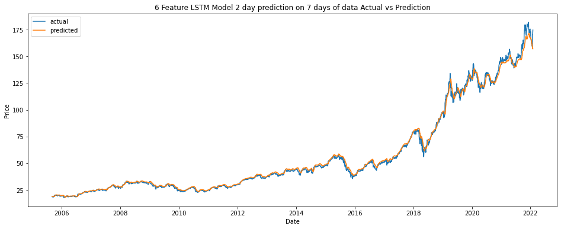
    


```python
keras.utils.plot_model(lstm_2d,
                       to_file='lstm_2d_model.png',
                       show_shapes=True,
                       show_layer_names=True,
                       )

```


    
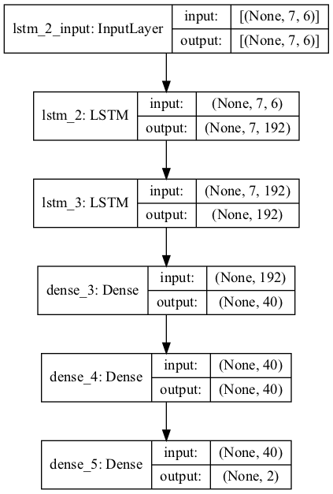
    


## CNN model


```python

model_cnn = Sequential()

model_cnn.add(keras.layers.Conv1D(filters=64, kernel_size=3, activation='relu', input_shape=(10, 6)))
model_cnn.add(keras.layers.MaxPool1D(pool_size=2))
model_cnn.add(keras.layers.Conv1D(filters=32, kernel_size=3, activation='relu'))
model_cnn.add(keras.layers.Flatten())
model_cnn.add(Dense(units=128, activation='relu'))
model_cnn.add(Dropout(rate = 0.15))
model_cnn.add(Dense(units=64, activation='relu'))
model_cnn.add(Dense(units=1))
model_cnn.compile(optimizer='adam', loss='mse', metrics=['mse'])
```


```python
X_train, y_train = preprocess_lstm(train_data, n_inputs=10, n_predictions=1, n_features=6)
```


```python
early_stop = EarlyStopping(monitor='val_loss', patience=10, verbose=1, mode='auto')
history_cnn = model_cnn.fit(X_train, y_train, epochs=20, batch_size=100, validation_split=0.2, callbacks=[early_stop], verbose=0)
```

    2022-02-28 11:21:32.303588: I tensorflow/core/grappler/optimizers/custom_graph_optimizer_registry.cc:112] Plugin optimizer for device_type GPU is enabled.
    2022-02-28 11:21:33.091731: I tensorflow/core/grappler/optimizers/custom_graph_optimizer_registry.cc:112] Plugin optimizer for device_type GPU is enabled.


```python


fig, ax = plt.subplots( figsize=(16, 6))
# ax.plot(history.history['accuracy'], label = 'accuracy', )
ax.plot(history_cnn.history['loss'], label = 'loss')
ax.plot(history_cnn.history['val_loss'], label = 'val_loss')
# ax.plot(history.history['val_accuracy'], label = 'val_accuracy')
ax.set_title('model accuracy')
ax.set_ylabel('accuracy')
ax.set_xlabel('epoch')
ax.legend()
```


    <matplotlib.legend.Legend at 0x3e0b75c10>


    
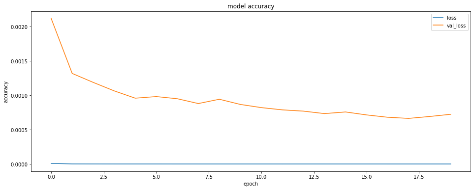
    


```python
# plot the predicted and actual values
X_testing, y_testing = preprocess_lstm(test_data, n_inputs=10, n_predictions=1, n_features=6)
y_predicted = model_cnn.predict(X_testing)
# Rescale the predicted values
y_testing = (y_testing - a_scaler.min_[3] )/a_scaler.scale_[3]
y_predicted = (y_predicted  - a_scaler.min_[3]  )/a_scaler.scale_[3]

fig, ax = plt.subplots( figsize=(16, 6))
ax.plot(dates[-len(test_data)+n_inputs:],y_testing, label = 'actual')
ax.plot(dates[-len(test_data)+n_inputs:],y_predicted, label = 'predicted')
ax.set_title(f'{6} Feature CNN Model Actual vs Prediction')
ax.set_ylabel('Price')
ax.set_xlabel('Date')
ax.legend()


```

    2022-02-28 11:21:41.298351: I tensorflow/core/grappler/optimizers/custom_graph_optimizer_registry.cc:112] Plugin optimizer for device_type GPU is enabled.


    <matplotlib.legend.Legend at 0x3e0ba9d60>


    
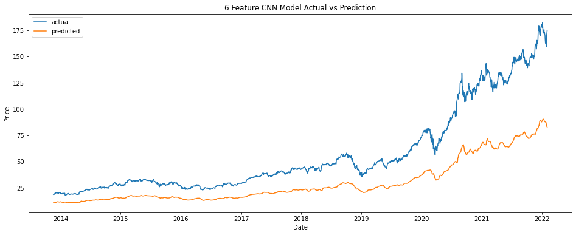
    


```python
keras.utils.plot_model(model_cnn,
                          to_file='cnn_model.png',
                            show_shapes=True,
                            show_layer_names=True,
                            )
```


    
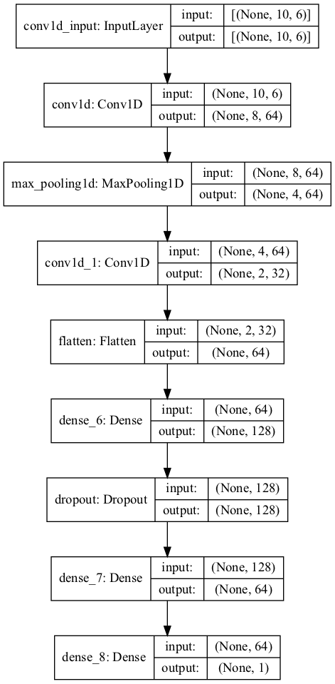
    


```python

```
